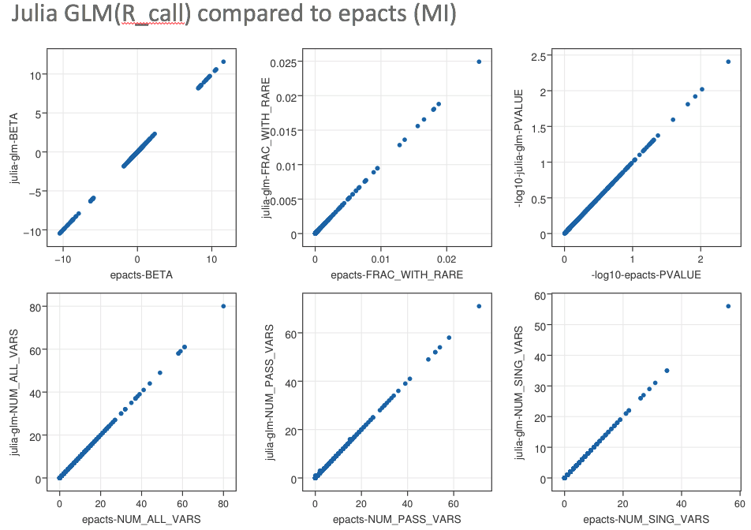

# RareBurdenTest

Rare variant burden test implemented based on [HTSJDK](https://github.com/samtools/htsjdk) and [Julia GLM](https://github.com/JuliaStats/GLM.jl). 
HTSJDK is used to fast parse vcf and compute the rare buden for each individual, the outputs are piped to Julia for fast association test.
Julia's GLM is about 300X faster than the R glm version, and the Julia's statistical ecosystem makes
it very convenient to implement other type of statistical testing. Therefore, by the piping design strucure, 
it's very easy to implement other type of test by Julia as plugin.
Currrent verison supports epacts's **b.burden** and **b.collapse** tests, detail about the testing please check [here](https://genome.sph.umich.edu/wiki/EPACTS).

- **Addititonal future supported than epacts: weigh rare variant by specify weight in group file.**

Benchmarked with epacts, it has the same results if we use R version of GLM.

As the convergency termination condition is different between Julia's GLM with R's GLM, 
for some cases of very small effective number, and non significant association, the estimation between 
them are different. Basically, Julia's GLM will have smaller estimation for beta and beta's standard error.
But for the true assocaition and converged estimation, both of the estimation are identical.

