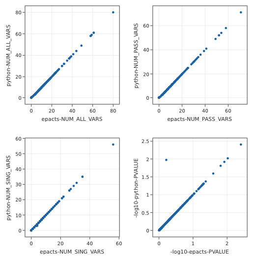
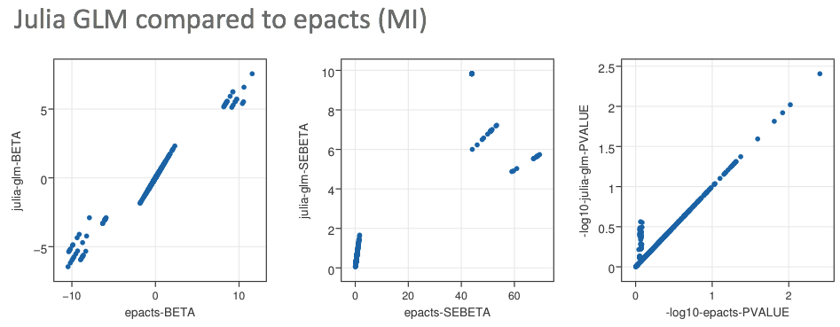

# RareBurdenTest

Rare variant burden test was implemented based on [cyvcf2](https://github.com/brentp/cyvcf2) and [Julia GLM](https://github.com/JuliaStats/GLM.jl).
cyvcf2 is a very fast VCF parser, binding on `C` version of htslib, both memory and CPU efficiency. cyvcf2 was used to compute the rare burden for each individual based on different variant masks, MAFs and weights, the outputs are piped to Julia for fast association test.
Julia's GLM is about 300X faster than the R glm version, and the Julia's statistical ecosystem makes
it very convenient to implement other type of statistical testing. Therefore, by the piping design structure,
it's very easy to implement other type of test by using Julia as plugin.
Current version supports epacts's **b.burden** and **b.collapse** tests, detail about the testing please check [here](https://genome.sph.umich.edu/wiki/EPACTS).

**Features**
- Group rare variants by epacts like grouping file
- Support weigh variant by specifying weight in grouping file, OR based on MAF. 1/(N*MAF*(1-MAF))^0.5, Madsen and Browning (2009).
- In a single run, generate scores for multiple MAF with no extra cost for parsing VCF again and again.
- Support glm test, firth logistic test and SPAtest(Optimized for small number and unbalanced case/control data).

**Variant scoring**
- Please see `VCFCountScore4GeneMask/VCFCountScore4GeneMask.py`

**Association of variant score with phenotype**
- Please see `Julia/RareRegressionAuto.R.SPA.jl`

**Benchmarks**
Benchmarked with epacts, it has the same results if we use R version of GLM (MIGEN chr22, LOFTEEHC, 25k cases and 25k controls, MAF=0.01).

The only dot difference is because of the inclusion of one variant, epacts included a variant with REF allele frequency < MAF. I don't think is good as we usually do annotation based on a REF -> ALT mutation, in my version of rare burden test, I only included ALF allele frequency <= MAF.

As the convergency termination condition is different between Julia's GLM with R's GLM,
for some cases of very small effective number, and non significant association, the estimation between
them are different. Basically, Julia's GLM will have smaller estimation for beta and beta's standard error.
But for the true association and converged estimation, both of the estimation are identical.

